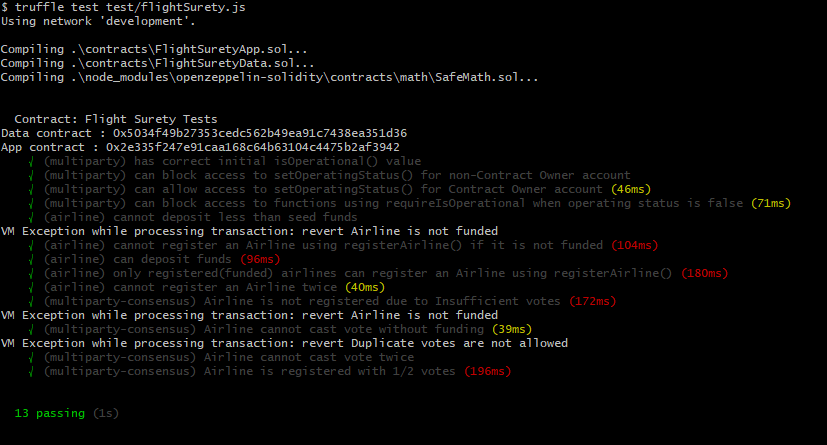
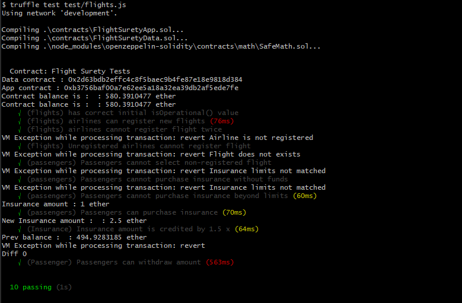
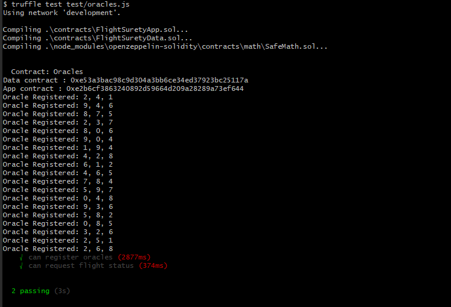

# FlightSurety

FlightSurety is a sample application for flight insurance developed in Ethereum.

## Install

This repository contains Smart Contract code in Solidity (using Truffle), tests (also using Truffle), dApp scaffolding (using HTML, CSS and JS) and server app scaffolding.

To install, download or clone the repo, then:

`npm install`
`truffle compile`

## Develop Client

To use the dapp:

`truffle migrate`
`npm run dapp`

To view dapp:

`http://localhost:8000`

## Develop Server

`npm run server`
`truffle test ./test/oracles.js`

## Deploy

To build dapp for prod:
`npm run dapp:prod`

Deploy the contents of the ./dapp folder

# Testing Smart Contracts

1. Testing : Airlines registration and multipartt consensus  
Run below command to test airlines registration and multiparty consensus  
`truffle test test/flightSurety.js`

2. Testing : Flights registration and multipartt consensus  
Run below command to test flights registration and multiparty consensus  
`truffle test test/flights.js`

3. Testing : Oracles registrations and responses  
Run below command to test oracles registration  
`truffle test test/oracles.js`
